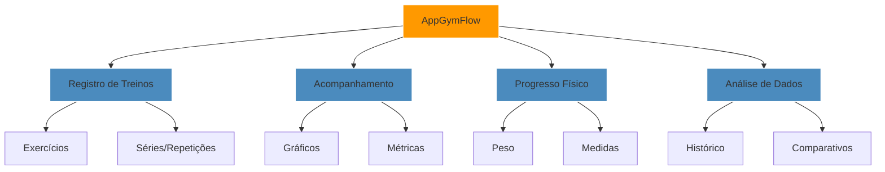
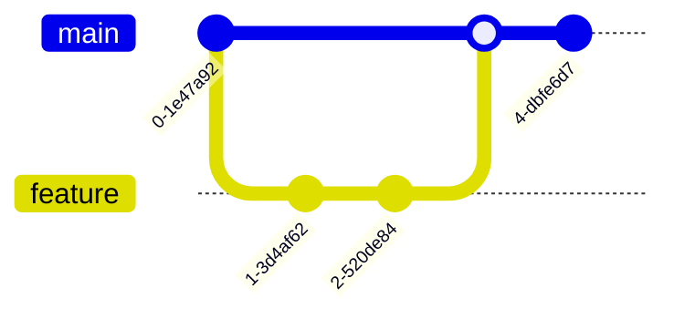

<div align="center">

```
      ___           ___           ___           ___       ___       ___     
     /\__\         /\  \         /\__\         /\__\     /\__\     /\  \    
    /::|  |       /::\  \       /:/  /        /:/  /    /:/  /    /::\  \   
   /:|:|  |      /:/\:\  \     /:/  /        /:/  /    /:/  /    /:/\:\  \  
  /:/|:|  |__   /::\~\:\  \   /:/  /  ___   /:/  /    /:/  /    /:/  \:\  \ 
 /:/ |:| /\__\ /:/\:\ \:\__\ /:/__/  /\__\ /:/__/    /:/__/    /:/__/ \:\__\
 \/__|:|/:/  / \:\~\:\ \/__/ \:\  \ /:/  / \:\  \    \:\  \    \:\  \ /:/  /
     |:/:/  /   \:\ \:\__\    \:\  /:/  /   \:\  \    \:\  \    \:\  /:/  / 
     |::/  /     \:\ \/__/     \:\/:/  /     \:\  \    \:\  \    \:\/:/  /  
     /:/  /       \:\__\        \::/  /       \:\__\    \:\__\    \::/  /   
     \/__/         \/__/         \/__/         \/__/     \/__/     \/__/    

```

<h3>🏋️ Aplicativo de Acompanhamento de Treinos</h3>

[](https://flutter.dev/)
[](https://dart.dev/)
[](https://www.android.com/)
[](LICENSE)

[📱 Sobre](#-sobre) • 
[✨ Funcionalidades](#-funcionalidades) • 
[🛠️ Instalação](#️-instalação) • 
[💻 Desenvolvimento](#-desenvolvimento)

</div>

## 📱 Sobre

<div align="center">



AppGymFlow: Seu personal trainer digital, transformando dados em resultados.

</div>

## ✨ Funcionalidades

<table align="center">
  <tr>
    <td align="center" width="25%">
      
      <br/><strong>📋 Registro</strong>
      <br/><sub>• Cadastro de exercícios<br/>• Personalização de treinos<br/>• Histórico detalhado</sub>
    </td>
    <td align="center" width="25%">
      
      <br/><strong>📊 Progresso</strong>
      <br/><sub>• Gráficos interativos<br/>• Análise de evolução<br/>• Comparativos</sub>
    </td>
    <td align="center" width="25%">
      
      <br/><strong>💪 Métricas</strong>
      <br/><sub>• Registro de peso<br/>• Medidas corporais<br/>• Evolução física</sub>
    </td>
    <td align="center" width="25%">
      
      <br/><strong>🌓 Interface</strong>
      <br/><sub>• Tema claro/escuro<br/>• Design responsivo<br/>• Acessibilidade</sub>
    </td>
  </tr>
</table>

## 🛠️ Instalação

<details>
<summary>📦 Pré-requisitos</summary>

- Flutter SDK 3.16+
- Android Studio / VS Code
- Git
- Dispositivo Android ou Emulador
</details>

<details>
<summary>⚡ Passos de Instalação</summary>

```bash
# Clone o repositório
git clone https://github.com/seu-usuario/AppGymFlow.git
cd AppGymFlow

# Torne o script executável
chmod +x build_apk.sh

# Gere o APK
./build_apk.sh

# Localize o APK em:
# AppGymFlow/build/app/outputs/flutter-apk/app-debug.apk
```
</details>

## 🛠️ Stack Tecnológica

<div align="center">

| Mobile | State | Storage | Graphics |
|--------|-------|---------|----------|
|  |  |  |  |
| Dart 2.19+ | Provider | Local Storage | FL Chart |

</div>

## 📂 Estrutura do Projeto

```plaintext
🏋️ AppGymFlow/
├── 📊 lib/
│   ├── 🏆 models/
│   ├── 📡 providers/
│   ├── 📱 screens/
│   └── 🧩 widgets/
├── 🖼️ assets/
└── 📦 android/
```

## 🔄 Fluxo de Desenvolvimento



## 👨‍💻 Autor

<div align="center">
  
  <h3>Kelvin Moraes</h3>
  <p>Mobile Developer | Fitness Tech Enthusiast</p>
  
[](https://github.com/KerubinDev)
[](mailto:kelvin.moraes117@gmail.com)
</div>

## 📝 Licença

Projeto sob licença GNU GPL v3. Consulte [LICENSE](LICENSE) para detalhes.

---

<div align="center">
  
  **[⬆ Voltar ao topo](#appgymflow)**
  
  <sub>Desenvolvido com 💪 por Kelvin Moraes</sub>
  
[](https://github.com/KerubinDev/AppGymFlow)
</div>

# GymFlow

## Configuração do Projeto

### 1. Fontes
O projeto usa a fonte Poppins. Siga os passos abaixo para configurá-la:

1. Baixe os arquivos da fonte Poppins:
   ```bash
   mkdir -p assets/fonts
   cd assets/fonts
   
   # Baixa as fontes
   wget https://github.com/google/fonts/raw/main/ofl/poppins/Poppins-Regular.ttf
   wget https://github.com/google/fonts/raw/main/ofl/poppins/Poppins-Medium.ttf
   wget https://github.com/google/fonts/raw/main/ofl/poppins/Poppins-Bold.ttf
   ```

2. Verifique se os arquivos foram baixados corretamente:
   ```bash
   ls -l assets/fonts/
   ```

### 2. Outros Assets
...